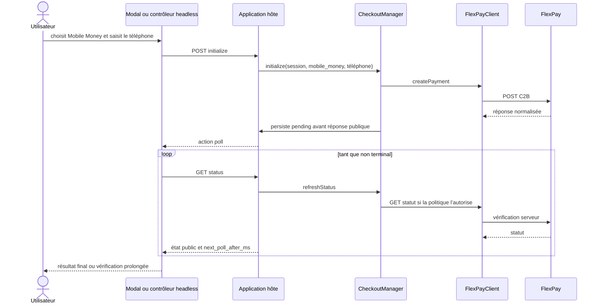
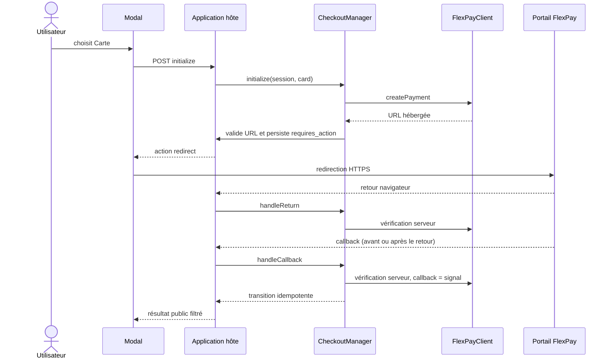

# Parcours de checkout

## Mobile Money

```mermaid
sequenceDiagram
    actor U as Utilisateur
    participant UI as Modal ou contrôleur headless
    participant A as Application hôte
    participant C as CheckoutManager
    participant F as FlexPayClient
    participant P as FlexPay
    U->>UI: choisit Mobile Money et saisit le téléphone
    UI->>A: POST initialize
    A->>C: initialize(session, mobile_money, téléphone)
    C->>F: createPayment
    F->>P: POST C2B
    P-->>F: réponse normalisée
    C->>A: persiste pending avant réponse publique
    A-->>UI: action poll
    loop tant que non terminal
        UI->>A: GET status
        A->>C: refreshStatus
        C->>F: GET statut si la politique l’autorise
        F->>P: vérification serveur
        P-->>F: statut
        A-->>UI: état public et next_poll_after_ms
    end
    UI-->>U: résultat final ou vérification prolongée
```

## Carte hébergée

```mermaid
sequenceDiagram
    actor U as Utilisateur
    participant UI as Modal
    participant A as Application hôte
    participant C as CheckoutManager
    participant F as FlexPayClient
    participant P as Portail FlexPay
    U->>UI: choisit Carte
    UI->>A: POST initialize
    A->>C: initialize(session, card)
    C->>F: createPayment
    F-->>C: URL hébergée
    C->>A: valide URL et persiste requires_action
    A-->>UI: action redirect
    UI->>P: redirection HTTPS
    P-->>A: retour navigateur
    A->>C: handleReturn
    C->>F: vérification serveur
    P-->>A: callback (avant ou après le retour)
    A->>C: handleCallback
    C->>F: vérification serveur, callback = signal
    C-->>A: transition idempotente
    A-->>UI: résultat public filtré
```
